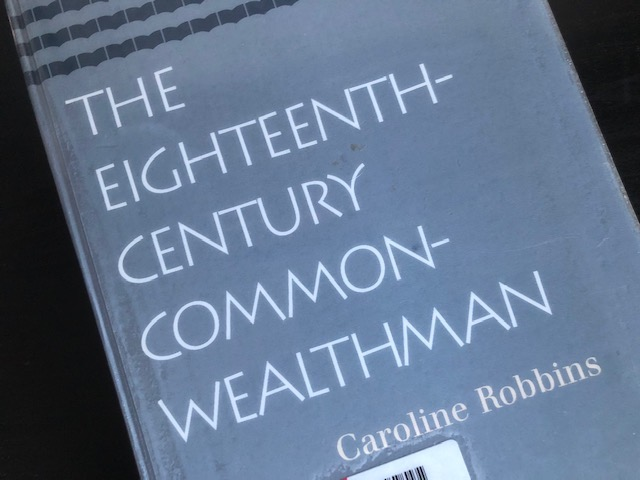

<!-- Custom style sheet -->
<link rel="stylesheet" type="text/css" href="../style.css">

  
Re-reading old history books  
    Caroline Robbins’ Eighteenth-Century Commonwealthman (1959) is a real classic
  

  
Part of the joy of starting a new research project is that you get the chance to read a lot of new literature. I am currently reading about translation and conceptual history, book history and the history of English republicanism. But I am also actively re-reading a lot of older historiography I first came across when I got my teeth stuck into seventeenth-century English republican thought for my MA and PhD theses. One of the books I have recently re-visited is Caroline Robbins’ Eighteenth-Century Commonwealthman (1959), now a classic in its own right.

Of course, a lot of it was still familiar in a reassuring way. The authors it covers, John Milton, James Harrington, Henry Neville, Algernon Sidney, John Toland and Robert Molesworth, among many others - back then virtual strangers I was only slowly getting to know - have by now become old friends. 

Robbins’ narrative analysis about the transmission of English republican ideas from the mid-seventeenth-century to revolutionary America has burnt itself into my brain just like the narrative of J.G.A. Pocock’s monumental Machiavellian Moment (1975), which starts the journey of ideas in the Italian Renaissance, but still ends up where Robbins does, across the Atlantic.

Where Robbins’ work was a collective biography of English-speaking Commonwealth authors, bringing together brief life sketches of an extraordinary number of authors writing on cognate issues, Pocock’s work was the biography of an idea travelling continents.

However, the re-reading of any work after a long time also lets you see its flaws more clearly, in part because of the plethora of secondary literature that has been published in the meantime, criticising and revising the arguments as well as developing them further. 

Reading Robbins now makes me question her assessment of Neville as someone who ‘definitely accepted a part at least of the Restoration Settlement’, wonder why she considered Sidney a moderate in 1649, and why she decided not to include authors like Henry Vane the younger, who moved in the same circles as Neville, Sidney and Milton, and who had many admirers in the seventeenth century, but was more interested in the rule of the saints than in constitutional structures. 

The focus on classical republicanism at the expense of religious republicanism has been a noted feature of much of the historiography of seventeenth-century English political thought and perhaps skewed the picture of what political thinkers were engaging with at the time because a present-focused, teleological or Whig approach to history made us look for the things we could relate to and make use of in our present-day lives. 

Also absent from both Robbins and Pocock as well as from much of the literature coming out of the Cambridge School of the History of Political thought was an interest in non-canonical authors, or even ephemeral works whose authors we might never know, but whose output might have found much wider distribution at the time than that of a Harrington or a Neville.

Due to my own interest in translation and the European connections of English republicanism, of course, Robbins’ statement that she was aware of a ‘continental tradition’ of commonwealth ideas but decided that it ‘must here be ignored’ in particular stood out to me. (Pocock too acknowledged that republican ideas travelled from Europe to America but, at least within the Machiavellian Moment, did not address the ways in which they might have found their way back.)

Since the first publication of the Commonwealthman in 1959, much has changed, and work on the European contexts of English republicanism has been expanding, owing not least to John Morrill’s observation that the English Civil was the last of the European Wars of religion and Jonathan Scott’s snappier and more provocative comment that ‘The last act of the Thirty Years’ War, was not the Peace of Westphalia ... but the execution of Charles I’. 

It is nevertheless unfair to criticise earlier historians for not having seen what we see now, because they started from a different position. After all, the only reason we can see gaps in their research now is because they did this research in the first place – and we should not complain about the view which is offered from the shoulders of giants.

I am therefore just grateful that enthusiastic and enormously productive historians like Caroline Robbins existed who paved the way for many a PhD dissertation and new research projects on one of the authors she made better known to the world and who showed the value of a close reading of a great number of primary sources she so concisely summarised for easy reference.

Much older historiography meanwhile now seems spookily devoid of references to secondary literature, which in me always evokes nostalgia for a time when all that counted was good old primary research, close reading and contextualisation. But re-reading older works also makes me worry about the proliferation of new publications we have now, where so much is written on any given subject that it becomes increasingly hard to keep track even of the historiography in your own little area of expertise. 

So often do I find myself looking back to happier times, before the marketisation of Higher Education created the publish-or-perish mantra forcing scholars to write more and more about less and less, while also hoping that I will finally find the time that Caroline Robbins had to read all those primary sources.

gm

An earlier version of this text was first published [here](https://thehistorywoman.com/2021/01/22/re-reading-old-history-books/) 

